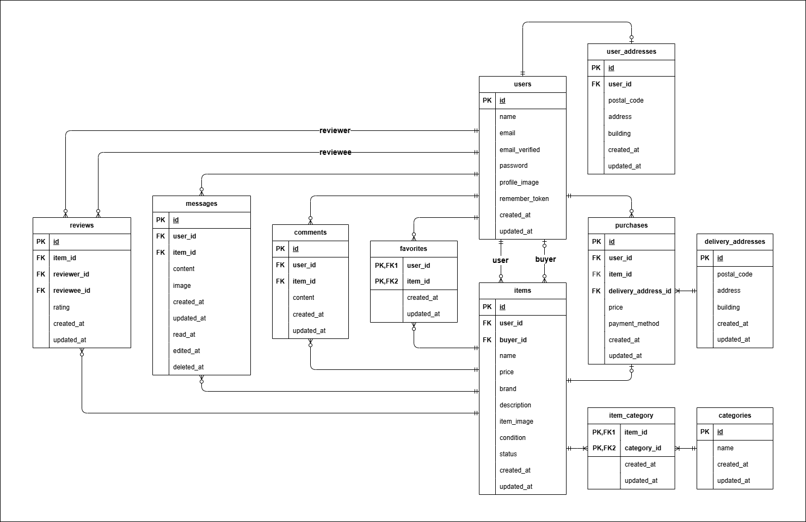

# フリマアプリ

**商品の出品と購入を行うことができるフリーマーケットアプリケーション**


## アプリケーション URL

| 該当画面                          | URL                                    |
| -------------------------------- | -------------------------------------- |
| 商品一覧画面                      | http://localhost/                      |
| ログイン画面                      | http://localhost/login/                |
| phpMyAdmin                       | http://localhost:8080/                 |
| MailHog                          | http://localhost:8025/                 |


## テストアカウント

Email: **test@example.com**  
Email: **test1@example.com**  
Email: **test2@example.com**  

Password: **password**  

> Seeder で３名のテストアカウントが作成されます。  
> いずれも共通パスワード(**password**)です。  


## 機能一覧

### 認証

- 会員登録
- メール認証
- ログイン
- ログアウト

### ゲストユーザー

- 商品一覧の取得
- 商品詳細の取得


- 商品の検索

### 認証済みユーザー

- マイリスト一覧の取得


- お気に入り商品の登録
- コメントの送信


- 商品の購入
- 支払い方法の選択
- 配送先の変更


- 商品の出品


- 取引チャットメッセージの送信
- 送信済みメッセージの編集
- 送信済みメッセージの削除


- 取引相手の評価（取引完了後）
- 他ユーザーからの平均評価の取得
- 商品購入者への取引完了通知メールの送信


- ユーザー情報の取得
- ユーザー情報の編集


- 出品した商品一覧の取得
- 購入した商品一覧の取得
- 取引中の商品一覧の取得


## テーブル設計

### users テーブル

| カラム名           | 型              | PRIMARY KEY | UNIQUE KEY | NOT NULL | FOREIGN KEY |
| ----------------- | --------------- | ----------- | ---------- | -------- | ----------- |
| id                | unsigned bigint |      〇     |            |    〇    |             |
| name              | varchar(20)     |             |            |    〇    |             |
| email             | varchar(255)    |             |     〇     |    〇    |             |
| email_verified_at | timestamp       |             |            |          |             |
| password          | varchar(255)    |             |            |    〇    |             |
| profile_image     | varchar(255)    |             |            |          |             |
| remember_token    | varchar(100)    |             |            |          |             |
| created_at        | timestamp       |             |            |    〇    |             |
| updated_at        | timestamp       |             |            |    〇    |             |

### user_addresses テーブル

| カラム名      | 型              | PRIMARY KEY | UNIQUE KEY | NOT NULL | FOREIGN KEY |
| ------------ | --------------- | ----------- | ---------- | -------- | ----------- |
| id           | unsigned bigint |      〇     |            |    〇    |             |
| user_id      | unsigned bigint |             |            |    〇    | users(id)   |
| postal_code  | varchar(8)      |             |            |    〇    |             |
| address      | varchar(255)    |             |            |    〇    |             |
| building     | varchar(255)    |             |            |          |             |
| created_at   | timestamp       |             |            |    〇    |             |
| updated_at   | timestamp       |             |            |    〇    |             |

### items テーブル

| カラム名      | 型              | PRIMARY KEY | UNIQUE KEY | NOT NULL | FOREIGN KEY |
| ------------ | --------------- | ----------- | ---------- | -------- | ----------- |
| id           | unsigned bigint |      〇     |            |    〇    |             |
| user_id      | unsigned bigint |             |            |    〇    | users(id)   |
| buyer_id     | unsigned bigint |             |            |          | users(id)   |
| name         | varchar(255)    |             |            |    〇    |             |
| price        | bigint          |             |            |    〇    |             |
| brand        | varchar(255)    |             |            |          |             |
| description  | text            |             |            |    〇    |             |
| item_image   | varchar(255)    |             |            |    〇    |             |
| condition    | tinyint         |             |            |    〇    |             |
| status       | tinyint         |             |            |    〇    |             |
| created_at   | timestamp       |             |            |    〇    |             |
| updated_at   | timestamp       |             |            |    〇    |             |


**condition**

- 1 : 良好
- 2 : 目立った傷や汚れなし
- 3 : やや傷や汚れあり
- 4 : 状態が悪い


**status**

- 0 : 出品中
- 1 : 入金待ち
- 2 : 取引中
- 3 : 取引完了


### categories テーブル

| カラム名    | 型              | PRIMARY KEY | UNIQUE KEY | NOT NULL | FOREIGN KEY |
| ---------- | --------------- | ----------- | ---------- | -------- | ----------- |
| id         | unsigned bigint |      〇     |            |    〇    |             |
| name       | varchar(255)    |             |     〇     |    〇    |             |
| created_at | timestamp       |             |            |    〇    |             |
| updated_at | timestamp       |             |            |    〇    |             |

### item_category テーブル

| カラム名      | 型              | PRIMARY KEY           | UNIQUE KEY | NOT NULL | FOREIGN KEY    |
| ------------ | --------------- | --------------------- | ---------- | -------- | -------------- |
| item_id      | unsigned bigint | item_id + category_id |            |    〇    | items(id)      |
| category_id  | unsigned bigint | item_id + category_id |            |    〇    | categories(id) |
| created_at   | timestamp       |                       |            |    〇    |                |
| updated_at   | timestamp       |                       |            |    〇    |                |

### purchases テーブル

| カラム名              | 型              | PRIMARY KEY | UNIQUE KEY | NOT NULL | FOREIGN KEY            |
| -------------------- | --------------- | ----------- | ---------- | -------- | ---------------------- |
| id                   | unsigned bigint |      〇     |            |    〇    |                        |
| user_id              | unsigned bigint |             |            |    〇    | users(id)              |
| item_id              | unsigned bigint |             |            |    〇    | items(id)              |
| delivery_address_id  | unsigned bigint |             |            |    〇    | delivery_addresses(id) |
| price                | bigint          |             |            |    〇    |                        |
| payment_method       | tinyint         |             |            |    〇    |                        |
| created_at           | timestamp       |             |            |    〇    |                        |
| updated_at           | timestamp       |             |            |    〇    |                        |


**payment_method**

- 1 : コンビニ支払い
- 2 : カード支払い


### delivery_addresses テーブル

| カラム名      | 型              | PRIMARY KEY | UNIQUE KEY | NOT NULL | FOREIGN KEY |
| ------------ | --------------- | ----------- | ---------- | -------- | ----------- |
| id           | unsigned bigint |      〇     |            |    〇    |             |
| postal_code  | varchar(8)      |             |            |    〇    |             |
| address      | varchar(255)    |             |            |    〇    |             |
| building     | varchar(255)    |             |            |          |             |
| created_at   | timestamp       |             |            |    〇    |             |
| updated_at   | timestamp       |             |            |    〇    |             |

### favoritesテーブル

| カラム名    | 型              | PRIMARY KEY       | UNIQUE KEY | NOT NULL | FOREIGN KEY |
| ---------- | --------------- | ----------------- | ---------- | -------- | ----------- |
| user_id    | unsigned bigint | user_id + item_id |            |    〇    | users(id)   |
| item_id    | unsigned bigint | user_id + item_id |            |    〇    | items(id)   |
| created_at | timestamp       |                   |            |    〇    |             |
| updated_at | timestamp       |                   |            |    〇    |             |

### comments テーブル

| カラム名    | 型              | PRIMARY KEY | UNIQUE KEY | NOT NULL | FOREIGN KEY |
| ---------- | --------------- | ----------- | ---------- | -------- | ----------- |
| id         | unsigned bigint |      〇     |            |    〇    |             |
| user_id    | unsigned bigint |             |            |    〇    | users(id)   |
| item_id    | unsigned bigint |             |            |    〇    | items(id)   |
| content    | text            |             |            |    〇    |             |
| created_at | timestamp       |             |            |    〇    |             |
| updated_at | timestamp       |             |            |    〇    |             |

### messages テーブル

| カラム名    | 型              | PRIMARY KEY | UNIQUE KEY | NOT NULL | FOREIGN KEY |
| ---------- | --------------- | ----------- | ---------- | -------- | ----------- |
| id         | unsigned bigint |      〇     |            |    〇    |             |
| user_id    | unsigned bigint |             |            |    〇    | users(id)   |
| item_id    | unsigned bigint |             |            |    〇    | items(id)   |
| content    | text            |             |            |    〇    |             |
| image      | varchar(255)    |             |            |          |             |
| created_at | timestamp       |             |            |    〇    |             |
| updated_at | timestamp       |             |            |    〇    |             |
| read_at    | timestamp       |             |            |          |             |
| edited_at  | timestamp       |             |            |          |             |
| deleted_at | timestamp       |             |            |          |             |

### reviews テーブル

| カラム名      | 型              | PRIMARY KEY | UNIQUE KEY            | NOT NULL | FOREIGN KEY |
| ------------ | --------------- | ----------- | --------------------- | -------- | ----------- |
| id           | unsigned bigint |      〇     |                       |    〇    |             |
| item_id      | unsigned bigint |             | item_id + reviewer_id |    〇    | items(id)   |
| reviewer_id  | unsigned bigint |             | item_id + reviewer_id |    〇    | users(id)   |
| reviewee_id  | unsigned bigint |             |                       |    〇    | users(id)   |
| rating       | tinyint         |             |                       |    〇    |             |
| created_at   | timestamp       |             |                       |    〇    |             |
| updated_at   | timestamp       |             |                       |    〇    |             |


## ER図




## 環境構築

### Docker ビルド

1. 以下のコマンドでリポジトリをクローンし、Docker コンテナをビルドして起動する。

```bash
git clone git@github.com:some-git-hub/flea-market.git
cd flea-market
docker-compose up -d --build
```

> MySQL は OS によって起動しない場合があるため、  
> それぞれの PC に合わせて「docker-compose.yml」を編集してください。

### Laravel 環境構築

1. 依存パッケージをインストールし、環境ファイルを作成する。

```bash
docker-compose exec php bash
composer install
cp .env.example .env
```

2. 「.env」に以下の環境変数を追記する。

```text
DB_CONNECTION=mysql
DB_HOST=mysql
DB_PORT=3306
DB_DATABASE=laravel_db
DB_USERNAME=laravel_user
DB_PASSWORD=laravel_pass
```

3. アプリケーションキーを生成し、DB 初期化を実行する。

```bash
php artisan key:generate
php artisan migrate --seed
```

4. 画像アップロードに必要なストレージリンクを作成する。

```bash
php artisan storage:link
```


### Stripe 環境構築

1. Stripe CLI をインストールしてログインする。

2. 「.env」に以下の Stripe の環境変数を追記する。

```text
STRIPE_KEY=pk_test_yourkey                      # 公開可能キー (Publishable Key)
STRIPE_SECRET=sk_test_yoursecret                # 秘密キー (Secret Key)
STRIPE_WEBHOOK_SECRET=whsec_yourwebhooksecret   # Webhookシークレット
```

> STRIPE_KEY と STRIPE_SECRET は Stripe ダッシュボードから取得する。  
> STRIPE_WEBHOOK_SECRET は Webhook 作成時に Stripe から取得する。

3. 以下のコマンドを実行すると、外部の Stripe イベントをテストできる。

```bash
stripe listen --forward-to http://localhost/api/stripe/webhook
```

4. 別のターミナルで以下のようなコマンドを実行すると、  
任意の Stripe イベント ( 例 : payment_intent.succeeded ) をテストできる。

```bash
stripe trigger payment_intent.succeeded \
  --add "payment_intent:metadata[user_id]=1" \
  --add "payment_intent:metadata[item_id]=1" \
  --add "payment_intent:metadata[payment_method]=1" \
  --add "payment_intent:metadata[postal_code]=000-0000" \
  --add "payment_intent:metadata[address]=testAddress" \
  --add "payment_intent:metadata[building]=testBuilding"
```

> 以下のリンクは公式ドキュメントです。  
> https://docs.stripe.com/payments/checkout?locale=ja-JP

#### コンビニ決済（Stripe）

- コンビニ支払いを選択した場合、一時的に「入金待ち(status=1)」になる。
- Checkout セッションの有効期限は 3日後の23時59分となる。
- 24時間以内に入金が確認できなかった場合、注文はキャンセルとなり「出品中(status=0)」に戻る。
- 商品価格が30万円以上の場合、コンビニ支払いを選択できない。


### MailHog 環境構築

1. 「.env」に以下の環境変数を追記する。

```text
MAIL_MAILER=smtp
MAIL_HOST=mailhog
MAIL_PORT=1025
MAIL_USERNAME=null
MAIL_PASSWORD=null
MAIL_ENCRYPTION=null
MAIL_FROM_ADDRESS=flea-market@example.com
MAIL_FROM_NAME="FleaMarket"
```

2. http://localhost:8025 にアクセスすると、開発環境でメール送信を確認できる。


### テスト環境構築

1. 「.env.testing」を作成する。

```bash
docker-compose exec php bash
cp .env .env.testing
```

2. 「.env.testing」に以下の環境変数を追記する。

```text
DB_CONNECTION=mysql
DB_HOST=mysql
DB_PORT=3306
DB_DATABASE=demo_test
DB_USERNAME=root
DB_PASSWORD=root
```

3. テスト用DBを作成する。(パスワード:**root**)

```bash
docker-compose exec mysql bash
mysql -u root -p
CREATE DATABASE demo_test;
```

4. テストを実行する。

```bash
docker-compose exec php bash
php artisan migrate --seed --env=testing
php artisan test
```


## 使用技術

- PHP 8.1.33
- Laravel 8.83.8
- MySQL 8.0.26
- Nginx 1.21.1
- Stripe (決済処理)
- MailHog (開発環境でのメール送信確認)

