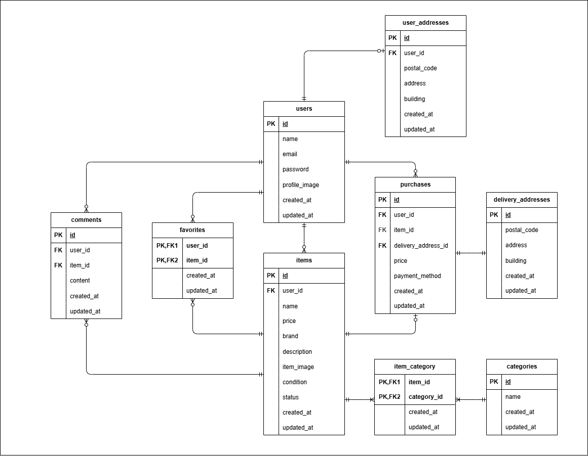

# フリマアプリ

## 環境構築

### Dockerビルド

1. `git clone git@github.com:some-git-hub/flea-market.git`
2. `docker-compose up -d --build`

> MySQLはOSによって起動しない場合があるため、  
> それぞれのPCに合わせて「docker-compose.yml」を編集してください。


### Laravel 環境構築

1. `docker-compose exec php bash`
2. `composer install`
3. `cp .env.example .env`
4. 「.env」に以下の環境変数を追記する。

```text
DB_CONNECTION=mysql
DB_HOST=mysql
DB_PORT=3306
DB_DATABASE=laravel_db
DB_USERNAME=laravel_user
DB_PASSWORD=laravel_pass
```

5. `php artisan key:generate`
6. `php artisan migrate --seed`
7. 「.env」に以下の Stripe の環境変数を追記する。

```text
STRIPE_KEY=pk_test_yourkey                      # 公開可能キー (Publishable Key)
STRIPE_SECRET=sk_test_yoursecret                # 秘密キー (Secret Key)
STRIPE_WEBHOOK_SECRET=whsec_yourwebhooksecret   # Webhookシークレット
```

> STRIPE_KEY と STRIPE_SECRET は Stripe ダッシュボードから取得する。  
> STRIPE_WEBHOOK_SECRET は Webhook 作成時に Stripe から取得する。


### Stripe Webhook 環境構築

1. Stripe CLI をインストールしてログインする。

2. 以下のコマンドを実行すると、外部の Stripe イベントをテストできる。

```bash
stripe listen --forward-to http://localhost/api/stripe/webhook
```

3. 別のターミナルで以下のようなコマンドを実行すると、  
任意の Stripe イベント ( 例 : payment_intent.succeeded ) をテストできる。

```bash
stripe trigger payment_intent.succeeded \
 --add "payment_intent:metadata[user_id]=1" \
 --add "payment_intent:metadata[item_id]=1" \
 --add "payment_intent:metadata[payment_method]=1" \
 --add "payment_intent:metadata[postal_code]=000-0000" \
 --add "payment_intent:metadata[address]=testAddress" \
 --add "payment_intent:metadata[building]=testBuilding"
```

**コンビニ決済（Stripe）**

- Stripe の仕様上、30万円以上の決済はできません。
- 本アプリでは、コンビニ決済を選択した場合は一旦「入金待ち (status=2)」になります。
- Checkout セッションの有効期限は 24時間です。
- 24時間以内に入金が確認できなかった場合、注文はキャンセルとなり「在庫あり (status=0)」に戻ります。


### MailHog 環境構築

1. 「.env」に以下の環境変数を追記する。

```text
MAIL_MAILER=smtp
MAIL_HOST=mailhog
MAIL_PORT=1025
MAIL_USERNAME=null
MAIL_PASSWORD=null
MAIL_ENCRYPTION=null
```

2. http://localhost:8025 にアクセスすると、開発環境でメール送信を確認できる。


## 使用技術

- PHP 8.1.33
- Laravel 8.83.8
- MySQL 8.0.26
- Nginx 1.21.1
- Stripe (決済処理)
- MailHog (開発環境でのメール送信確認)


## ER図




## URL

- 開発環境: http://localhost/
- phpMyAdmin: http://localhost:8080/
- MailHog: http://localhost:8025/